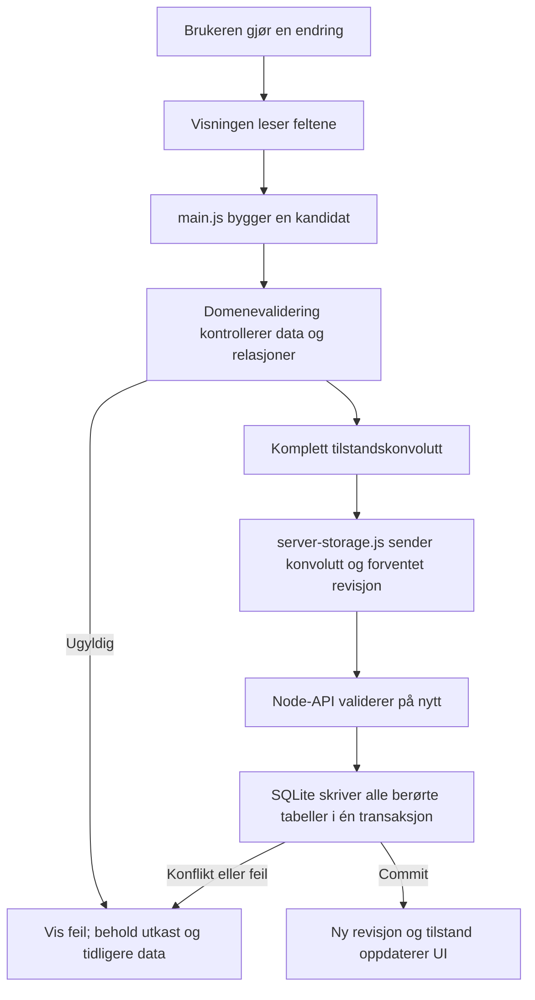

# Slik virker Studieplan

Studieplan er en lokal studieplanlegger skrevet med vanlig JavaScript, HTML og CSS. Reglene er faste og forklarbare; appen bruker ingen KI-tjeneste under kjøring. KI har bidratt i utviklingsarbeidet. Studentens egne erfaringer og vurderinger hører hjemme i [refleksjonsutkastet](project-reflection.md).

## To lokale kjøremåter

| Kjøremåte | Autoritativ lagring | Bruksområde |
| --- | --- | --- |
| Docker/produksjon | Node-API og SQLite | Den komplette leveransen. Node serverer den bygde Vite-klienten, validerer alle endringer og skriver databasen transaksjonelt. Compose publiserer bare på `127.0.0.1` og beholder databasen i et navngitt volum. |
| Vite-utvikling | Nettleserens `localStorage` | Rask lokal UI-utvikling og den vanlige nettlesertestsuiten. Denne modusen bruker ikke SQLite og er derfor ikke bevis for produksjonslagringen. |

Ved første produksjonsstart kan en tom database tilby å kopiere gyldige eksisterende nettleserdata. Originalen i nettleseren beholdes. Flyttingen bruker fingeravtrykk og arkivkvittering, slik at samme datasett ikke importeres flere ganger. Eksport og validert gjenoppretting kan brukes når appen åpnes på en annen lokal adresse.

## Fra brukerhandling til SQLite

En ny oppgave trenger bare et navn. Emne, frist, hovedestimat, gjenstående arbeid, prioritet, avhengigheter og innleveringskrav kan legges til når de er kjent. [tasks.js](../../studieplanlegger/src/tasks.js) normaliserer og validerer oppgaven. [storage.js](../../studieplanlegger/src/storage.js) velger lagringsadapter: Vite-/nettlesermodusen validerer den komplette konvolutten før `localStorage`, mens produksjonsadapteren sender kandidaten og forventet revisjon til [state-api.js](../../studieplanlegger/server/state-api.js). API-et validerer hele datasettet og relasjonene før [database.js](../../studieplanlegger/server/database.js) skriver SQLite.

Klienten sender revisjonen den sist leste. Hvis en annen endring allerede har økt revisjonen, svarer API-et med HTTP 409 i stedet for å overskrive nyere data. Den avviste kandidaten blir ikke delvis lagret; klienten må lese gjeldende tilstand og la brukeren prøve endringen på nytt. Vanlige flerfanekonflikter blir dermed oppdaget i produksjonsmodus. Vite-modus har ikke serverrevisjoner og er fortsatt en utviklingsbane, ikke den anbefalte varige leveransen.

## Tre forskjellige planleggingsfunksjoner

**Oppgaveforslag («Hva kan jeg gjøre nå?»)** velger en startklar handling som passer den valgte tiden. [tasks.js](../../studieplanlegger/src/tasks.js) bruker blant annet neste steg eller gjenstående arbeid, frist, prioritet og avhengigheter. Ett forslag vises som hovedvalg; resten er alternativer. Et forslag registrerer verken tid eller arbeid.

**Kapasitetsberegning** vurderer om registrert gjenstående arbeid får plass i bekreftede arbeidsvinduer og eksisterende studieøkter. [work-capacity.js](../../studieplanlegger/src/work-capacity.js) tar hensyn til undervisning/opptatt tid, frister, avhengigheter, låste reservasjoner, delbarhet og økt-/pauseregler. Resultatet forklarer reservert, foreslått, manglende og ledig tid. Beregningen endrer ikke planen.

**Omplanlegging** lager et konkret forslag til framtidige studieøkter når planen ikke lenger passer. [replanning.js](../../studieplanlegger/src/replanning.js) bruker samme arbeidsvinduer, opptatt tid, frister, avhengigheter og regler, men produserer økter som brukeren kan kontrollere, redigere, godta eller forkaste. Forslaget har et fingeravtrykk av utgangspunktet og kan ikke godtas hvis dataene har endret seg i mellomtiden.

Ingen av funksjonene hevder at arbeid er utført. De bruker registrerte opplysninger og kan bare bli så presise som frister, estimater, arbeidsvinduer og avhengigheter tillater.

## Planlagt tid, faktisk arbeid, ferdig og levert

| Opplysning | Betydning |
| --- | --- |
| Planlagt eller foreslått tid | En framtidig reservasjon eller beregnet mulighet. Den er ikke gjennomføringshistorikk. |
| Faktisk arbeid | Minutter og utfall studenten registrerer etter arbeid. Arbeidsloggen kan brukes i frivillige, lokale estimatforslag. |
| Gjenstående arbeid | Studentens nåværende anslag for det som fortsatt må gjøres. Det reduseres ikke bare fordi en økt er passert. |
| Ferdig / fullført | Studenten har bekreftet at selve arbeidet er ferdig. Hvis oppgaven skal leveres, er den da «klar til levering». |
| Levert | Studenten har separat bekreftet innlevering. Studieplan kontrollerer ikke lærestedets innleveringssystem. |

«Neste steg gjort» fjerner det aktive steget, men registrerer ikke automatisk minutter og fullfører ikke hele oppgaven. Null gjenstående arbeid betyr heller ikke automatisk ferdig. Disse skillene gjør at kalenderen, arbeidsloggen og innleveringsstatusen ikke brukes som bevis for hverandre.

## Feil, sikkerhetskopi og gjenoppretting

Ugyldige felt eller relasjoner avvises før skriving. En SQLite-endring som består av flere tabelloperasjoner kjøres i én transaksjon; enten lagres hele tilstanden med ny revisjon, eller så beholdes den forrige. Erstattende endringer lager et begrenset recovery-øyeblikksbilde. Innstillinger lar brukeren eksportere en portabel JSON-sikkerhetskopi og forhåndsvise en validert gjenoppretting før databasen erstattes. Recovery, angre og papirkurv er hjelp mot nylige brukerhandlinger, ikke en erstatning for en separat sikkerhetskopi ved diskfeil.

## Hva testene kontrollerer

- [Enhetstestene](../../studieplanlegger/tests/unit) dekker validering, relasjoner, forslag, kapasitet, omplanlegging, arbeidsstatus, SQLite-migrering, revisjonskonflikter, recovery og sikkerhetskopi.
- [Nettlesertestene](../../studieplanlegger/tests/e2e) kontrollerer de synlige brukerflytene. Den vanlige suiten bruker Vite/localStorage.
- `npm run test:e2e:database` bygger klienten, starter Node/SQLite med en midlertidig database på loopback og kjører den produksjonsrettede databaseflyten.
- [VERIFICATION.md](../../studieplanlegger/VERIFICATION.md) skiller daterte, faktisk kjørte kontroller fra historiske eller utestede påstander.

Testene bruker syntetiske data. Et grønt bygg viser at den kontrollerte tekniske flyten virker; det dokumenterer ikke studentens opplevde nytte eller læring. Slike vurderinger må komme fra [utprøvingsloggen](trial-log.md) og studentens egne svar i [refleksjonsutkastet](project-reflection.md).
