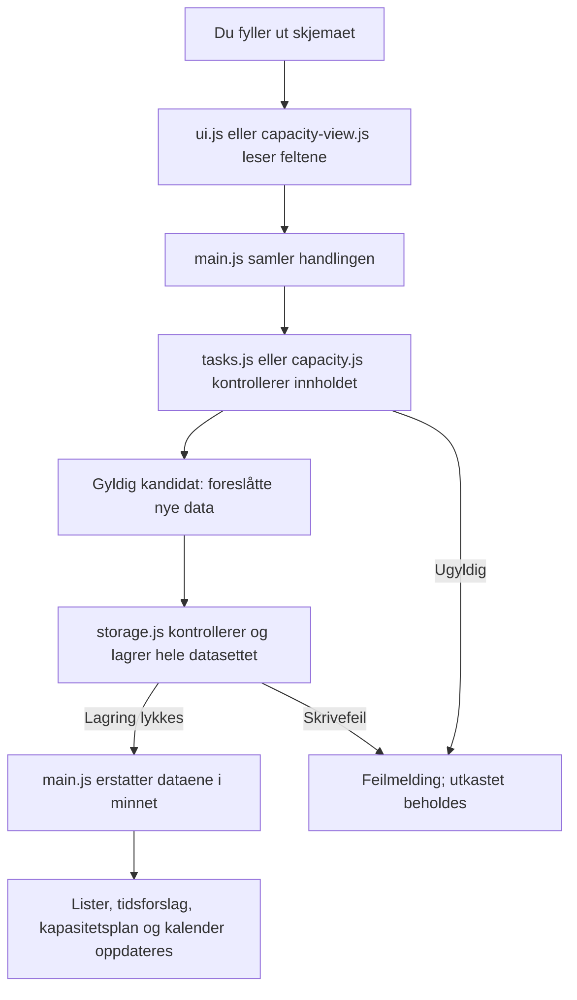

# Slik virker studieplanleggeren

Appen er en lokal nettside skrevet med vanlig JavaScript, HTML og CSS. Reglene i appen er faste og forklarbare; den bruker ingen KI-tjeneste når du planlegger. KI har bidratt til å utvikle prosjektet. Din forståelse og dine erfaringer kan du beskrive med spørsmålene i [prosjektrefleksjonen](project-reflection.md).

## Fra skjema til lagret oppgave

Du skriver for eksempel «Les kapittel 3», emne, frist og 90 minutter. [Skjemaet](../../studieplanlegger/index.html) har separate felt for dato og klokkeslett. [ui.js](../../studieplanlegger/src/ui.js) setter dem sammen til for eksempel `2026-10-12T12:00` og sender handlingen til [main.js](../../studieplanlegger/src/main.js). [validateDraft i tasks.js](../../studieplanlegger/src/tasks.js) fjerner mellomrom rundt tittelen og kontrollerer blant annet at fristen finnes og minuttene er gyldige.

En *kandidat* er bare de nye dataene vi ønsker å lagre. Kontrolleren viser ikke «lagret» før [storage.js](../../studieplanlegger/src/storage.js) har lykkes. Deretter beregnes alle visninger fra samme data. Dette hindrer at kalenderen viser en vellykket endring som lagringen avviste. Rene regelfunksjoner leser verken skjermen eller lagringen; derfor kan de testes med små, kjente eksempler.

## To ulike slags tidsforslag

**«Hva kan jeg gjøre nå?» velger én passende handling.** `selectTasksForMinutes` i [tasks.js](../../studieplanlegger/src/tasks.js) velger uferdige oppgaver der neste stegs estimat passer tiden. Gjenstående må være større enn null, også når et aktivt steg passer. Uten et aktivt steg brukes gjenstående tid, eller hovedestimatet hvis gjenstående ikke er angitt. Oppgavene sorteres etter frist, med opprinnelig rekkefølge ved lik frist. Første treff blir hovedforslaget; resten er alternativer, ikke en samlet arbeidsplan.

Eksempel: Hovedestimat 240 minutter, gjenstående 90 og neste steg «Les oppgaveteksten» på 20 minutter. Steget passer et tidsvalg på 30 minutter. Det betyr ikke at hele oppgaven rekker å bli ferdig. Forfalte oppgaver kan fortsatt foreslås her, slik at du kan ta tak i dem.

**Kapasitetsplanen fordeler hele det gjenstående arbeidet.** [capacity.js](../../studieplanlegger/src/capacity.js) bruker registrerte studieøkter og nåværende klokkeslett:

1. Finn ledig tid fra nå av. Bare hele framtidige minutter brukes; det påbegynte minuttet rundes opp til neste minutt. Tid som allerede er gått, kan ikke brukes. Overlapp telles én gang.
2. Sorter uferdige oppgaver etter nærmeste frist. Lik frist beholder oppgaverekkefølgen.
3. Fyll de tidligste ledige minuttene fram til oppgavens frist. Del arbeidet mellom økter ved behov.
4. Trekk de tildelte minuttene fra øktenes ledige tid før neste oppgave behandles.
5. Vis `mangler = gjenstående − foreslåtte minutter før fristen`, med årsak.

Anta at begge øktene ligger i framtiden:

| Oppgave | Gjenstår / frist | Forslag ved økter 10–11 og 11:30–12:30 |
| --- | --- | --- |
| A | 90 min / kl. 12 | 60 min i første økt + 30 min kl. 11:30–12 |
| B | 30 min / kl. 13 | 30 min kl. 12–12:30 |

A får aldri tid etter kl. 12. Hvis A i stedet trenger 120 minutter, mangler den 30 minutter før fristen selv om det finnes senere studietid. B kan fortsatt bruke tiden etter kl. 12. Neste stegs 20 minutter legges ikke til A: steget er en del av de 90 eller 120 minuttene.

Regelen er valgt fordi du kan kontrollere hvert valg. Den vurderer ikke vanskelighetsgrad, avhengigheter mellom oppgaver, pauser eller hvor krevende det er å bytte emne. Øktene må derfor beskrive tid du faktisk vil bruke til arbeid. Forslaget endres når tid går eller du endrer oppgaver og økter; det er ingen avtale eller gjennomføringshistorikk.

## Forslag, utført arbeid og levering

| Opplysning | Hva den betyr |
| --- | --- |
| Foreslåtte minutter | Tid algoritmen har funnet plass til. Arbeid er ikke registrert som gjort. |
| Gjenstående minutter | Ditt oppdaterte anslag for hele oppgaven, inkludert neste steg. |
| Ferdig med arbeidet / Fullført | Din manuelle bekreftelse på utført arbeid. Oppgaven trenger ingen kapasitet. |
| Klar til levering | Arbeidet er ferdig, men levering er ikke bekreftet. Fristen følges fortsatt opp. |
| Levert | Du har selv bekreftet levering. Appen kontrollerer ikke innleveringssystemet. |

«Neste steg gjort» fjerner steget. Det måler ikke faktisk tidsbruk og trekker ikke automatisk fra estimatet. Oppdater gjenstående tid etterpå. Null gjenstående fullfører heller ikke oppgaven automatisk: bekreft status selv. Et tidligere anslag beholdes ved fullføring, slik at du kan angre; gjennomgå anslaget hvis du åpner arbeidet igjen.

## Ugyldige data og lagringsfeil

Negative eller desimale minutter, en ugyldig dato og slutt før start gir feltfeil. Gjenstående kan være null; et hovedestimat og et stegestimat må være positive. Overlappende økter avvises i skjemaet og utkastet beholdes. Kalenderen skiller økter og frister med tekst og utforming, slik at farge alene ikke må tolkes.

Lagringen bruker samme nøkkel, `studieplanlegger:v1`, og versjon som tidligere. Nye felt er valgfrie: eldre oppgaver bruker hovedestimatet som gjenstående, og manglende økter betyr en tom øktliste. Innlesing skriver ikke om data, og gammel fullføring tolkes aldri som levering. Hele lagringskandidaten kontrolleres før skriving. Uleselig JSON eller ugyldige lagrede felt sperrer endringer og gir «Prøv igjen»; appen nullstiller ikke dataene.

Ved skrivefeil beholdes tidligere lagring og skjemaets utkast. Du må prøve lagringen igjen; en feilmelding betyr at endringen ikke er lagret. Lokal lagring er valgt for å unngå konto og server. Begrensningene er at nettleserdata kan slettes, at data ikke synkroniseres, og at to redigerende faner kan overskrive hverandre. Bruk samme adresse, nettleserprofil og tidssone. Detaljer om klokkeoverganger og økter står i [README](../../studieplanlegger/README.md).

## Hva testene forteller

| Testfiler | Hva de kontrollerer – og hvorfor |
| --- | --- |
| [tasks.test.js](../../studieplanlegger/tests/unit/tasks.test.js), [next-action.test.js](../../studieplanlegger/tests/unit/next-action.test.js) | Gyldige felt, stabile ID-er, steg og separat levering. Hindrer at én handling utilsiktet endrer andre opplysninger. |
| [storage.test.js](../../studieplanlegger/tests/unit/storage.test.js) | Ugyldig lagring, skrivefeil, bevaring og nytt forsøk. Hindrer falsk lagringssuksess og stille tap av data. |
| [remaining.test.js](../../studieplanlegger/tests/unit/remaining.test.js), [calendar.test.js](../../studieplanlegger/tests/unit/calendar.test.js) | Historiske frist-/tidsregler, lokal uke, sommertid og norsk klokke. Filnavnet `remaining.test.js` er eldre enn kapasitetsfunksjonen. |
| [capacity.test.js](../../studieplanlegger/tests/unit/capacity.test.js) | Fordeling, kapasitetsmangel, overlapp, frist midt i økt, forfalt/ferdig arbeid og gamle estimater. Kontrollerer at ingen framtidig arbeidsplan bruker tid som ikke er tilgjengelig før fristen. |
| [capacity-invariants.test.js](../../studieplanlegger/tests/unit/capacity-invariants.test.js) | Prøver varierte arbeidsmengder og kontrollerer hvert tildelte minutt mot økt, frist og øvrige tildelinger. En ekstra lik eller innestengt økt skal ikke skape mer kapasitet. |
| [capacity.spec.js](../../studieplanlegger/tests/e2e/capacity.spec.js), [capacity-lifecycle.spec.js](../../studieplanlegger/tests/e2e/capacity-lifecycle.spec.js) og [andre nettlesertester](../../studieplanlegger/tests/e2e) | Skjema, lagring, omlasting og mobil/tastatur gjennom den faktiske nettsiden. Hele oppgaveløpet prøves med lagrede økter, også med skrivefeil og nytt forsøk. Regler alene beviser ikke at knappene virker sammen. |

Testene bruker kunstige data og styrt klokke. Et produksjonsbygg kontrollerer at prosjektet kan pakkes; det beviser ikke at appen hjelper deg å starte eller huske levering. Faktisk kjørte kontroller står i [kapasitetsevidensen](capacity-evidence.md). Nytte og egen forståelse undersøker du med [utprøvingsloggen](trial-log.md) og [refleksjonsspørsmålene](project-reflection.md).
