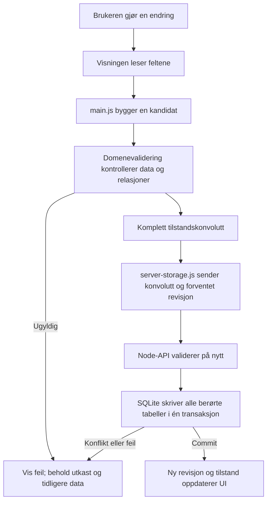

# Slik virker Studieplan

Studieplan er en lokal studieplanlegger skrevet med vanlig JavaScript, HTML og CSS. Reglene er faste og forklarbare; appen bruker ingen KI-tjeneste under kjøring. KI har bidratt i utviklingsarbeidet, som er dokumentert i [utviklingsprosessen](development-process.md). Dokumentet er ikke studentens personlige refleksjonsrapport.

## To lokale kjøremåter

| Kjøremåte | Autoritativ lagring | Bruksområde |
| --- | --- | --- |
| Docker/produksjon | Node-API og SQLite | Den komplette leveransen. Node serverer den bygde Vite-klienten, validerer alle endringer og skriver databasen transaksjonelt. Compose publiserer bare på `127.0.0.1` og beholder databasen i et navngitt volum. |
| Vite-utvikling | Nettleserens `localStorage` | Rask lokal UI-utvikling og den vanlige nettlesertestsuiten. Denne modusen bruker ikke SQLite og er derfor ikke bevis for produksjonslagringen. |

Ved første produksjonsstart kan en tom database tilby å kopiere gyldige eksisterende nettleserdata. Originalen i nettleseren beholdes. Flyttingen bruker fingeravtrykk og arkivkvittering, slik at samme datasett ikke importeres flere ganger. Eksport og validert gjenoppretting kan brukes når appen åpnes på en annen lokal adresse.

Kontrollen 1. oktober 2026 beholder disse kjøremåtene. Feilet kildeoppdatering bevarer tidligere undervisning og valg, og registrerer nytt forsøk separat fra siste vellykkede kontroll. En enkelt HTTP-feil bekrefter ikke innloggingskrav. Kapasitetsberegning reserverer også økter uten oppgave og varsler om egne aktiviteter med ukjent tid; plansammenligning teller ikke samme tidsintervall som arbeid for flere oppgaver. Gjentatt import av arbeidssteg bevarer allerede redigerte og fullførte steg. Se [gjeldende verifikasjon](../../studieplanlegger/VERIFICATION.md) og [datatypefordelt importdekning](../../studieplanlegger/IMPORT-COVERAGE.md).

## Fra brukerhandling til SQLite

```mermaid
flowchart TD
  Form[Brukeren gjør en endring] --> UI[Visningen leser feltene]
  UI --> Action[main.js bygger en kandidat]
  Action --> Rules[Domenevalidering kontrollerer data og relasjoner]
  Rules -->|Ugyldig| Error[Vis feil; behold utkast og tidligere data]
  Rules --> State[Komplett tilstandskonvolutt]
  State --> Storage[server-storage.js sender konvolutt og forventet revisjon]
  Storage --> API[Node-API validerer på nytt]
  API --> DB[SQLite skriver alle berørte tabeller i én transaksjon]
  DB -->|Commit| Refresh[Ny revisjon og tilstand oppdaterer UI]
  DB -->|Konflikt eller feil| Error
```

En ny oppgave trenger bare et navn. Emne, frist, hovedestimat, gjenstående arbeid, prioritet, avhengigheter og innleveringskrav kan legges til når de er kjent. [tasks.js](../../studieplanlegger/src/tasks.js) normaliserer og validerer oppgaven. [storage.js](../../studieplanlegger/src/storage.js) velger lagringsadapter: Vite-/nettlesermodusen validerer den komplette konvolutten før `localStorage`, mens produksjonsadapteren sender kandidaten og forventet revisjon til [state-api.js](../../studieplanlegger/server/state-api.js). API-et validerer hele datasettet og relasjonene før [database.js](../../studieplanlegger/server/database.js) skriver SQLite.

An optional task-adjacent proposal reduces first-time setup. [study-time.js](../../studieplanlegger/src/study-time.js) distinguishes confirmed work windows, selected study-time preferences, concrete one-off candidates, and provisional assumptions. A saved pattern is reused, while “Det varierer” and the no-choice draft create no weekly pattern. [replanning-view.js](../../studieplanlegger/src/replanning-view.js) presents readable sessions and reveals manual date/time fields only as the final move option. [replanning.js](../../studieplanlegger/src/replanning.js) retains rule enforcement, scopes task-adjacent changes, validates move alternatives, and rejects stale drafts before writing.

Klienten sender revisjonen den sist leste. Hvis en annen endring allerede har økt revisjonen, svarer API-et med HTTP 409 i stedet for å overskrive nyere data. Den avviste kandidaten blir ikke delvis lagret; klienten må lese gjeldende tilstand og la brukeren prøve endringen på nytt. Vanlige flerfanekonflikter blir dermed oppdaget i produksjonsmodus. Vite-modus har ikke serverrevisjoner og er fortsatt en utviklingsbane, ikke den anbefalte varige leveransen.

## Programimport i én sammenhengende flyt

En lokal, regelbasert tekstregistrering gir et kompakt, redigerbart forslag for oppretting av oppgave eller egen aktivitet samt endring av frist eller gjenstående arbeid. En trygg, deklarativ tekst uten kommandoprefiks blir en oppgavetittel; spørsmål og uklare endre-, flytte- eller sletteønsker blir aldri automatisk opprettet. Tittel er eneste obligatoriske oppgavefelt, mens tomt/«uten emne» og «vet ikke»/«mye» beholder henholdsvis manglende emnekobling og ukjent arbeid. Parseren har injisert referansetid, gjør korte og relative norske datoord om til konkrete Oslo-datoer, beholder frister uten klokkeslett som dato og skriver ingenting. Egne aktiviteter lagres uten falskt emne eller importkilde, og bare et kjent start-/sluttintervall reserverer kapasitet. Oppgavemål treffes eksakt eller krever valg. Ved bekreftelse kontrollerer `main.js` identitet og gammel verdi på nytt og bruker samme validering, historikk og revisjonsbeskyttede lagringsbane som skjemaene. Råteksten blir ikke del av domenet eller historikken.

Importerte kalenderhendelser kan bære `activityKind: "exam"` fra et strukturert ICS-felt gjennom kildegrunnlag, oppdatering, lagring og sikkerhetskopi. `activityKind: "assessment"` beholdes som separat, generell kildesemantikk og blir ikke normalisert til eksamen. Eldre hendelser klassifiseres for visning bare med et smalt tittelkriterium for eksamen/exam/examination og eksplisitte unntak for forberedelse, prøve-/mockeksamen og forelesninger om eksamen. Alle visninger henter samme presentasjonsmetadata (`📝 Eksamen` og egen aksent), mens domenets eksisterende `kind` fortsatt er undervisning eller informasjon slik at filtre og kapasitet beholder betydningen sin.

[vortex-programs.js](../../studieplanlegger/server/providers/vortex-programs.js) beholder publiserte krav og alternativgrener i stedet for å gjøre alle emner obligatoriske. HiMolde IT 2026–27 er regresjonseksempelet: IBE110 og IBE430 er påkrevde, mens studenten må velge enten IBE160 eller hele kombinasjonen IBE102 + IBE152. Studiepoeng vises, men avgjør ikke om et valg er gyldig.

[program-import-view.js](../../studieplanlegger/src/program-import-view.js) beholder program, kull og periode mens studenten korrigerer alternativet eller legger til et manglende emne. Et separat emnesøk er ikke programbevis, og en manuell post merkes uverifisert. Undervisning hentes og vises per emne; feil eller tilgangskrav blokkerer ikke gyldige emner eller vellykket undervisning. Før lagring kontrolleres fortsatt utvalgsøyeblikket og hele tilstandsgrunnlaget. Én commit skriver resultatet, og kvitteringen skiller emner med importert undervisning fra emner uten.

## Undervisningsvalg, oppdatering og kalenderidentitet

Programflyten og den separate emneflyten bruker samme undervisningskontrakt. Hvert emne beholder siste kontrollforsøk og siste vellykkede kontroll separat. Tom kilde, timeout, transportfeil, ugyldig kildesvar, tilgangskrav og manglende støtte gir forskjellige statuser; ingen av dem sletter tidligere lagret undervisning. Aktivitetstyper, valgte grupper, individuelle utelatelser og nye uavklarte grupper lagres med kildeobjekt og periode, slik at omlasting, nytt forsøk, SQLite-restart og sikkerhetskopi ikke endrer studentens valg.

En innholdsmessig og semantisk uendret oppdatering lagrer bare ny kontrolltid og avslutter med «Timeplanen er kontrollert – ingen endringer.» uten en ekstra bekreftelse. Endret kildeidentitet, dekning, varsler, aktivitetsvalg eller uavklarte grupper åpner fortsatt kontroll. Delvise DOM-oppdateringer gjenoppretter åpne detaljer, relevant fokus og intern rulleposisjon; sene svar fra et tidligere valg ignoreres.

[calendar-model.js](../../studieplanlegger/src/calendar-model.js) fører full emnekode videre til undervisning, frister og studieøkter. Alle kalendervisninger bruker samme deterministiske emnefarge, men viser også kode og tekstlig aktivitetstype eller status, slik at farge aldri er eneste identifikasjon.

## Tre forskjellige planleggingsfunksjoner

**Oppgaveforslag («Hva kan jeg gjøre nå?»)** velger en startklar handling som passer den valgte tiden. [tasks.js](../../studieplanlegger/src/tasks.js) bruker blant annet første startklare arbeidssteg eller gjenstående arbeid, frist, prioritet og avhengigheter. Ett forslag vises som hovedvalg; resten er alternativer. Et forslag registrerer verken tid eller arbeid. Sletting av et arbeidssteg sletter ikke oppgaven eller markerer den automatisk ferdig.

**Kapasitetsberegning** vurderer om registrert gjenstående arbeid får plass i bekreftede arbeidsvinduer og eksisterende studieøkter. [work-capacity.js](../../studieplanlegger/src/work-capacity.js) tar hensyn til undervisning/opptatt tid, frister, avhengigheter, låste reservasjoner, delbarhet og økt-/pauseregler. Resultatet forklarer reservert, foreslått, manglende og ledig tid. Beregningen endrer ikke planen.

**Omplanlegging** lager et konkret forslag til framtidige studieøkter når planen ikke lenger passer. [replanning.js](../../studieplanlegger/src/replanning.js) bruker samme arbeidsvinduer, opptatt tid, frister, avhengigheter og regler, men produserer økter som brukeren kan kontrollere, redigere, godta eller forkaste. Forslaget har et fingeravtrykk av utgangspunktet og kan ikke godtas hvis dataene har endret seg i mellomtiden.

Ingen av funksjonene hevder at arbeid er utført. De bruker registrerte opplysninger og kan bare bli så presise som frister, estimater, arbeidsvinduer og avhengigheter tillater.

## Planlagt tid, faktisk arbeid, ferdig og levert

| Opplysning | Betydning |
| --- | --- |
| Planlagt eller foreslått tid | En framtidig reservasjon eller beregnet mulighet. Den er ikke gjennomføringshistorikk. |
| Faktisk arbeid | Minutter og utfall studenten registrerer etter arbeid. Arbeidsloggen kan brukes i frivillige, lokale estimatforslag. |
| Gjenstående arbeid | Studentens nåværende anslag for det som fortsatt må gjøres. Det reduseres ikke bare fordi en økt er passert. |
| Ferdig / fullført | Studenten har bekreftet at selve arbeidet er ferdig. Hvis oppgaven skal leveres, er den da «klar til levering». |
| Levert | Studenten har separat bekreftet innlevering. Studieplan kontrollerer ikke lærestedets innleveringssystem. |

«Neste steg gjort» markerer det aktive steget fullført og beholder identitet og historikk. Handlingen registrerer ikke automatisk minutter og fullfører ikke hele oppgaven. Null gjenstående arbeid betyr heller ikke automatisk ferdig. Disse skillene gjør at kalenderen, arbeidsloggen og innleveringsstatusen ikke brukes som bevis for hverandre.

## Arbeidssteg, egenvurdering, kalenderkopi og plansammenligning

[work-steps.js](../../studieplanlegger/src/work-steps.js) gjør et eldre `nextStep` om til et stabilt, ordnet steg først når oppgaven faktisk endres. Stegene kan ha valgfrie estimater og avhengigheter, men [tasks.js](../../studieplanlegger/src/tasks.js) og planleggingsmodulene bruker fortsatt oppgavens gjenstående intervall som eneste totalsum. Dokumentforslag i [work-step-proposals.js](../../studieplanlegger/src/work-step-proposals.js) merker hver rad som kildekrav, arbeidsmåte eller uavklart og krever samlet godkjenning.

Rettelsen 2. oktober 2026 normaliserer også blandingen av `nextStep` og `steps` ved lesing, uten å skrive ved åpning. Eksisterende rekkefølge og ID-er beholdes; et separat eldre steg legges til med et deterministisk ledig ID-suffiks. Bare eksplisitt eldre opphav og identisk opprinnelig tekst, minutter og venteflagg kan representere samme steg; eksisterende fullføring og senere notater/forutsetninger blir bevart. Begge fjernhandlinger bruker samme sperre: avhengige steg navngis, og studenten må redigere forutsetningene før sletting. Ingen koblinger fjernes automatisk.

Eldre tekst og avledede ID-er som var gyldige uten lengdegrense, beholdes tapsfritt ved normalisering, fullføring, SQLite-lagring og backup. Vanlige stegfelt beholder sine grenser. Tastaturfokus etter vellykket sletting går til et gjenværende steg eller legg-til-knappen; avvist lagring beholder hele utkastet for et atomisk nytt forsøk.

[review-planning.js](../../studieplanlegger/src/review-planning.js) lagrer valgfrie, daterte egenvurderinger knyttet til tema og eventuell avsluttet økt. Bare vurdering 1 eller 2 utløser et forklart forslag. Forslaget bruker registrerte arbeidsvinduer, opptatt tid og kalenderaktiviteter, lager ingen dato når eksamensdatoen er ukjent og blir ikke en vanlig studieøkt før studenten godkjenner eller justerer det. Utsettelse og avvisning hindrer duplikatforslag uten å endre vurderingen.

**Koblingsregelen:** vurderingen gjelder temaet. Oppgave og emne er valgfrie temakoblinger, mens en levende eller loggført økt er uavhengig valgfri kontekst; samme oppgave kreves ikke for historiske vurderinger. Nye ukjente referanser avvises. Automatisk avslutning bruker den faktisk validerte økten fra arbeidsloggen, aldri en annen nylig økt. Visningen bruker faktisk lagret historisk oppgave-/øktinformasjon og angir ukjent kontekst når den mangler. Gjenbrukt tema viser lagret eksamensdato; utelatt felt bevarer datoen, mens eksplisitt tomt felt fjerner den. Endringen følger eksisterende regler for framtidige repetisjonsvalg og omskriver ikke tidligere vurderinger eller ferdig repetisjon.

En repetisjonsøkt som allerede brukes som kontekst av en vurdering beholdes sammen med beslutningen ved endrede temainnstillinger. Ved uttrykkelig endring/sletting av vurderingen som eier beslutningen fjernes beslutningen; en økt som andre vurderinger fortsatt peker til beholder identitet, oppgave, tema og tidspunkt, mens bare foreldet `reviewKey` tas bort. Historiske vurderinger og arbeidsloggens øyeblikksbilder skrives aldri om for å reparere koblingen.

Forhåndsvisning og lagring bruker samme forberedelse av tema og framtidige planer. Endret grunnlag nullstiller tidligere godkjenning og foreldede automatiske tidsfelt; eksplisitt redigerte manuelle tider beholdes for et nytt valg. Historiske navn hentes bare fra samsvarende øyeblikksbilde, aldri fra dagens omdøpte oppgave. Den avgrensede reviewrettelsen gjør også at `purgeAssessments` fjerner frakoblede repetisjonsøkter med bare `reviewTopicId`, i samsvar med den eksisterende slettingen av arbeidshistorikk.

[calendar-export.js](../../studieplanlegger/src/calendar-export.js) eksporterer bare valgte, lagrede typer i synlig periode. Handlingen «Eksporter kalender» ligger øverst i kalendervisningen og viser antallet før nedlasting; en tom kombinasjon gir ingen fil, og en tvetydig frist forklares som utelatt til studenten presiserer tiden. Frister er transparente `VEVENT`-komponenter uten oppdiktet sluttid, der dato uten klokkeslett bruker `DTSTART;VALUE=DATE`, og studie-/undervisningsøkter er `VEVENT` i UTC beregnet fra norsk lokal tid. Filen bruker CRLF, UTF-8-sikker linjefolding, tekstescaping og stabile ugjennomsiktige 128-bits UID-er. Formatet er kontrollert mot RFC 5545 og leses tilbake med prosjektets låste `ical.js`; eksporten er en kopi og gir ingen synkronisering eller garanti mot duplikater i mottakerprogrammet. Microsoft dokumenterer at Outlook for Windows ignorerer `VTODO`, derfor brukes bare én `VEVENT`-representasjon per frist; faktisk import i en ekstern Outlook-klient er ikke testet lokalt.

Utelatelseslisten navngir frist, lagret datoverdi og konkret årsak uten å gjette et annet tidspunkt. Repetisjon uten oppgave bruker temaets faktiske tittel, eller et uttrykkelig manglende-tema-navn. Programvelgeren bruker norsk `nb-NO`-rekkefølge med stabile sekundærnøkler; gjenoppretting viser samme variantetikett med kode, nivå, kull og inntak. Kildens grupper, modeller og perioder beholder sin egen rekkefølge og identitet. De nye syntetiske nettleser- og produksjonsforløpene finnes i testfilene med `bounded` i navnet; faktiske kjøreresultater og begrensninger står i [VERIFICATION.md](../../studieplanlegger/VERIFICATION.md).

[plan-comparison.js](../../studieplanlegger/src/plan-comparison.js) beregner alle alternativer fra samme fingeravtrykk, klokkeslett og periode. «Behold dagens plan» er et nullalternativ; redusert kapasitet og valgt oppgaveprioritet går gjennom den eksisterende omplanleggeren. Sammenligning skriver ingenting. Bruk av ett forslag går gjennom samme revisjonskontroll og historikk som andre samlede planendringer, slik at et foreldet forslag avvises og en anvendt plan kan angres.

SQLite-tabellene `topics`, `assessments` og `review_decisions` har relasjonelle identitetskolonner og tapsfri JSON. Nettleserlagring, sikkerhetskopi, recovery og historikk bruker de samme valgfrie envelope-feltene. Personvernsletting fjerner arbeidshistorikk, egenvurderinger, beslutninger og tilhørende repetisjonsøkter også fra lokale recovery-kopier og lesbare legacy-arkiver; den endrer ikke sikkerhetskopier brukeren allerede har lastet ned.

## Feil, sikkerhetskopi og gjenoppretting

Ugyldige felt eller relasjoner avvises før skriving. En SQLite-endring som består av flere tabelloperasjoner kjøres i én transaksjon; enten lagres hele tilstanden med ny revisjon, eller så beholdes den forrige. Erstattende endringer lager et begrenset recovery-øyeblikksbilde. Innstillinger lar brukeren eksportere en portabel JSON-sikkerhetskopi og forhåndsvise en validert gjenoppretting før databasen erstattes. Recovery, angre og papirkurv er hjelp mot nylige brukerhandlinger, ikke en erstatning for en separat sikkerhetskopi ved diskfeil.

## Hva testene kontrollerer

- [Enhetstestene](../../studieplanlegger/tests/unit) dekker validering, relasjoner, forslag, kapasitet, omplanlegging, arbeidsstatus, SQLite-migrering, revisjonskonflikter, recovery og sikkerhetskopi.
- [Nettlesertestene](../../studieplanlegger/tests/e2e) kontrollerer de synlige brukerflytene. Den vanlige suiten bruker Vite/localStorage.
- `npm run test:e2e:database` bygger klienten, starter Node/SQLite med en midlertidig database på loopback og kjører den produksjonsrettede databaseflyten.
- [VERIFICATION.md](../../studieplanlegger/VERIFICATION.md) skiller daterte, faktisk kjørte kontroller fra historiske eller utestede påstander.

Testene bruker syntetiske data. Et grønt bygg viser at den kontrollerte tekniske flyten virker; det dokumenterer ikke studentens opplevde nytte eller læring. [Utviklingsprosessen](development-process.md) beskriver dette skillet og samler kildebelagte hendelser uten å fylle inn personlige vurderinger.

## Fleksibel registrering og egne aktiviteter

Tekstregistreringen godtar en trygg deklarativ tittel uten kommandoprefiks og viser først et kompakt forslag; emne, frist og arbeid ligger under valgfrie detaljer. Spørsmål og ukjent mutasjonsintensjon avvises. Korte datoer bruker inneværende Oslo-år når datoen ikke er passert; ellers kreves eksplisitt årsvalg. Ukjent arbeid er `null`, og tomt eller eksplisitt fravær av emne oppretter aldri et kunstig emne.

Egne kalenderaktiviteter ligger i `planner.events` med `activityKind: "personal"`, tom `courseId`, `dateLocal` og valgfri `start`/`end`. Bare begge instanser blokkerer kapasitet. Dato alene og start alene vises med eksplisitt usikkerhet på kalender-, agenda- og dagsflater. Kildeoppdatering er isolert gjennom fravær av kildeidentitet, og ICS-eksport krever et eget opt-in-valg og bevarer den lagrede presisjonen.
