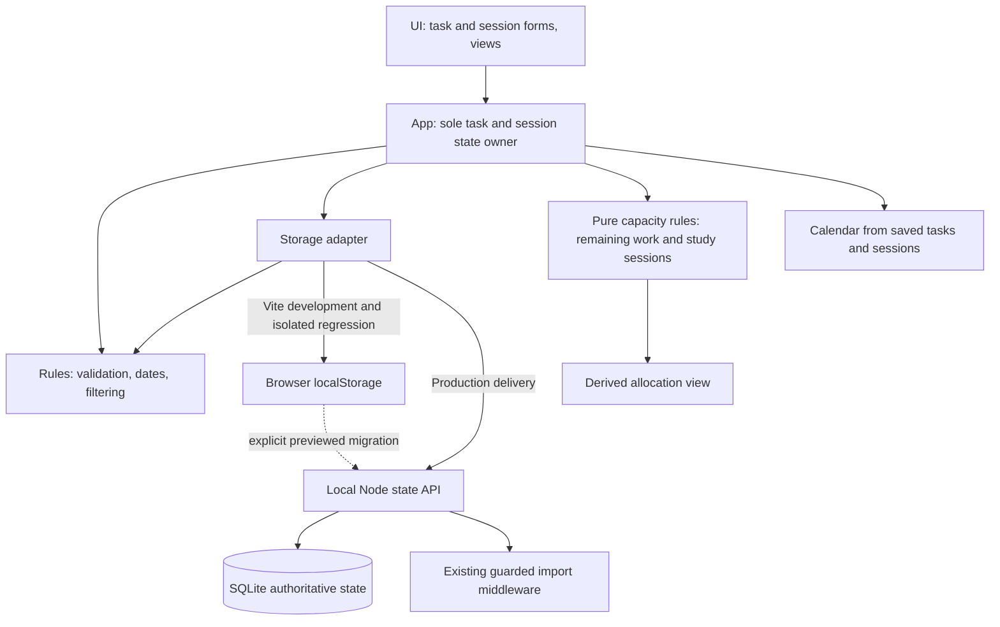

# Technical plan: Studieplanlegger

## Historical requirement key

The `FR`/`NFR` identifiers below are retained as traceability labels from the original planning baseline. FR-1 covers task creation; FR-2 editing/deletion; FR-3 work completion; FR-4 weekly overview; FR-5 time-fit suggestions; FR-6 durable reload of saved state; FR-7 one active next step; FR-8 separate manual submission confirmation; FR-9 the overview dashboard; and FR-10 the deadline calendar. NFR-1 is simple, accessible Norwegian use; NFR-2 is local privacy; and NFR-3 is predictable, safe rendering. Later decisions AD-8–AD-10 extend these contracts and supersede FR-6's original browser-only storage choice in the Docker/production delivery.

## AD-10 — Durable full-stack delivery, 2026-09-20

The production delivery is one local Node service: it serves the built Vite client, composes the guarded import middleware with versioned state endpoints, and owns a SQLite file at `/data/studieplan.sqlite`. SQLite is authoritative in this delivery. Every write validates the complete v1 relational envelope on the server, compares an optimistic revision and replaces all affected domain rows in one transaction before the browser updates memory. Indexed identity/relation columns support courses, tasks, sessions, dependencies, work logs, planner events/sources, document sources/entries, windows, preferences and history; each row also retains its complete JSON payload so optional provider fields round-trip without loss. Recovery snapshots, restore, history purge and the same-origin legacy transition are transactional database operations.

The existing v1 browser record is a read-only migration source in production, not a second authority. An empty database can preview and explicitly import an exact validated copy once; SHA-256 receipts make repeats no-ops, the raw source is archived, and browser data is never removed or rewritten. Different origins continue to use the privacy-safe portable backup flow. Compose publishes only `127.0.0.1:8088`, runs automatic migrations at server construction and persists `/data` in a named volume. Seed data is opt-in, validated and empty-database-only. The Vite development path retains browser storage for compatibility with the established isolated UI regression suite and is not the delivered production persistence mode.

## AD-9 — Connected planner extension, 2026-09-09

The connected-planner extension supersedes older exclusions below concerning imports, work history, dependencies, backup, concurrency and capacity. Its detailed build record is preserved in pre-cleanup Git commit `1a39aaf`; current source scope is authoritative in [IMPORT-COVERAGE.md](../../../../studieplanlegger/IMPORT-COVERAGE.md). The application remains vanilla JavaScript/Vite with a localStorage v1 envelope in development and SQLite behind the Node API in production. The older decisions remain historical context where they conflict with AD-10 or this extension.

- `main.js` owns the complete state and ordinary changes use `commitState` for one validated envelope write before updating memory. `storage.js` guards raw-read failures and concurrent storage changes. The explicit privacy purge first stages a scrubbed recovery journal, then commits the purged main envelope and reloads controller state; guarded rollback handles write failure without overwriting another writer. Unreadable recovery data causes refusal rather than false deletion success. `history.js` records compound changes to tasks, reservations, work logs, import sources, planner records and explicit preferences; undo/trash restores the operation together and rejects changed baselines.
- Title is the sole required task input. Empty course and deadline are valid. `estimatedMinutes` is preserved for older tasks; absent `remainingMinutes` falls back to it, explicit null means unknown, a nonnegative number is a remaining estimate, and zero is independent of completion. Reopening completed work with zero remaining explicitly sets unknown; positive, absent and already unknown values stay intact. Undo restores the whole prior transaction. Untouched legacy fields are not migrated by opening or saving unrelated details.
- Optional `workLogs` record operation/session identity, outcome, optional actual minutes, separately planned minutes, remaining work and a task snapshot. `work-log.js` never subtracts elapsed/actual time from remaining work. Missed work has no performed sample. Full completion and ordinary completion controls both release confirmed future reservations in the same transaction without submitting work. History purge removes complete affected undo/trash entries and recovery `data`/`raw`/`previous` copies, preserving active tasks, estimates, reservations and unrelated recovery content. Previously downloaded backup files remain outside this operation.
- `task-dependencies.js` validates the whole stable-ID graph, rejects cycles/self-links and preserves explicit missing prerequisites on deletion. External waiting is cleared only by a confirmed registered unblocking step. Suggestions rank eligible steps/tasks using their own and reachable unfinished dependents' deadlines before dependent count, with the motivating task/deadline explained; partial suggestions are labelled. `personal-estimates.js` requires five relevant complete task totals or five performed uninterrupted sessions, keeps these sample types distinct and returns only optional median/range proposals. Reopened or subsequently unfinished work is excluded from whole-completion samples.
- `replanning.js` allocates only within confirmed work windows, using existing Oslo/DST conversion and union/subtraction helpers. It excludes old movable reservations, preserves locks/fixed items, accounts for breaks and dependencies, and displays shortages/unknown work. Each generated session and both-side breaks are subtracted from the entire remaining free interval set. Locked sessions that violate breaks remain visible but cannot credit prerequisite completion. Indivisible work requires contiguous usable time; split locked fragments cannot unlock dependent work. Generated session endpoints must round-trip to their exact instants; ambiguous autumn endpoints are explained and later representable time remains usable. Capacity minute totals are distinguished from a checked plan with session/break rules. Preview edits and the clock/state baseline are revalidated before one apply; rejection writes nothing. Proposals are bounded to 500 sessions with an explicit limitation and remaining shortages.
- Optional `importSources` bind document content hashes/revisions and per-entry source baselines to course/task/activity targets. Optional course-entry `reference` preserves mapping without source ownership; legacy references are recognized from existing target ownership. Corrected kinds persist on identical repeats; explicit cross-kind replacement is atomic and refuses unsafe linked-target removal. Stable IDs and three-way comparisons preserve local edits; missing/ambiguous fields and completed/cancelled VTODO status require explicit correction or omission. Browser-local cancellable workers load pinned PDF.js, Mammoth and Papa Parse bundles, with size/page/expanded-text/work limits and no external resources. Original private files are not retained. Existing course-bound calendar source contracts remain stricter and separate.
- `server/providers` reads bounded verified public contracts with guarded addresses, source-specific pagination/completeness and cache. Program bindings retain program/cohort/study-semester/calendar-semester/campus/elective identity separately from teaching-group selection. Institution datatype evidence is distinct from implementation and real browser acceptance; [IMPORT-COVERAGE.md](../../../../studieplanlegger/IMPORT-COVERAGE.md) is authoritative for current source scope.
- Existing calendar/daily layout, source refresh, backup/credential redaction and origin isolation remain in place. The connected screens reuse the shell and native modal editors. Actual new unit/browser/build evidence belongs in [VERIFICATION.md](../../../../studieplanlegger/VERIFICATION.md); historical passes below are not connected-feature acceptance.
- Public HTML/JSON/PDF programme sources share guarded binary/text transport. HTTPS, public DNS pinning, per-provider redirects, cancellation and compressed/uncompressed size limits remain enforced. Public PDF text extraction runs in a terminable local Node worker with a 30-second deadline, streamed raw-text upper bound, separate readable-text minimum and success-only cache. Ansgar's source-published anonymous share redirects use a request-local same-origin cookie jar, cleared after the read; ephemeral download addresses never become persisted provenance. Public Drive PDFs are followed through parsed inert source metadata, without executing scripts or attempting login.
- Programme source revisions belong in `programBinding.sourceEdition`; course `sourceVersion` denotes semantic programme/cohort/course edition. A bounded legacy-hash transition requires matching known provider, source record and source address, preserving IDs, notes and task links without bypassing actual cohort/version conflicts. Year-only rows, dated elective availability and from/to version bounds are validated against explicit student semester/calendar choices.
- Public teaching uses source-owned TimeEdit objects or TP semester/course/term metadata. Confirmed volatile TP IDs receive a source-occurrence fingerprint; genuine UIDs stay unchanged. The normalized ICS explicitly carries identity/authoritativeness/warning markers through manual and background refresh. Room/end/description revisions keep identity; changed start/title needs human resolution and never authorizes disappearance deletion. Assessment markers without meaningful duration remain transparent information, not inferred deadlines.
- Institution calendars reuse document preview and its single transaction, with no automatic personal/course association. Stable source/entry identity retains confirmed course links on reimport. PHS VTODO deadlines are filtered by the explicitly selected Oslo calendar semester; known transparent institution rows persist consistent information flags. Unknown source rows remain visible and cannot cancel earlier entries by omission.
- Document sources optionally retain `complete` and bounded `warnings` (100 × 2,000 characters, with explicit truncation notice); absent legacy evidence stays unknown. Backup/undo validators and credential scrubbing include these fields. Editable event descriptions share a 2,000,000-character bound across preview and saved baselines. Structured row/field errors open affected disclosures and focus the first correction; incomplete native number input remains an error with its visible draft intact.
- Institutional/calendar/program teaching previews capture the actual selected class, URL, period, query and source object. Changes invalidate only draft results, and asynchronous responses plus final confirmation recheck the snapshot. Caller cancellation is composed with transport timeout and terminates document workers; stale responses cannot replace a newer draft or saved data.
- NHFH named semester rows have stable name-based source IDs. Explicit reimport can rebind an old semester-only ID only when provider, published programme URL/version, programme/study semester and original source name agree uniquely; local IDs and relations survive. Campus checks include both direct course metadata and the student's programme binding. Explicit source exclusions for an academic year block both corresponding calendar semesters; neither a generic current page nor a student clarification verifies an unpublished cohort.
- Text intent uses Unicode word boundaries. VTODO recurrence properties, including RDATE, require explicit selection as one concrete task and retain incomplete-source evidence; calendar-level METHOD:CANCEL requires explicit status resolution. Source snippets place cancellation/recurrence evidence before potentially long descriptions. No recurrence or cancellation silently changes saved work.

AD-8 below records the 2026-09-07 capacity extension. Actual current verification belongs in [VERIFICATION.md](../../../../studieplanlegger/VERIFICATION.md); detailed earlier specifications and feature evidence remain available in pre-cleanup commit `1a39aaf`. The [Norwegian solution guide](../../../implementation-artifacts/solution-guide.md) explains the implementation with examples.

## Design paradigm

Small layered browser application. Technical choices below are agent-selected defaults under the user's delegation, not individually confirmed choices. The original implementation and the next-step/submission additions exist with recorded tests. This contract includes the authorized dashboard redesign and deadline calendar while preserving those task rules. D1–D8 retain local dates, safe whole minutes and deterministic suggestions; “Oversikt” replaces the old initial weekly view, and date/time entry becomes explicit date plus 24-hour `HH:mm`. Current results are consolidated in [VERIFICATION.md](../../../../studieplanlegger/VERIFICATION.md).



## Invariants and rules

### AD-1 — One owner and dependency direction

- **Binds:** All implementation units.
- **Prevents:** Separate views maintaining inconsistent tasks or bypassing validation.
- **Rule:** Follow the dependencies above. UI sends actions to the app controller; only that controller replaces saved task/session state after the active storage adapter confirms the write. Rules are pure functions without DOM or storage access. Views, dashboard counts and calendar days derive from saved tasks; filtering and sorting never mutate the source list. The calendar widget owns only transient display/selection state and requests existing edit actions. One optional active next step belongs to its task. Production uses the local backend in AD-10; there is still no account, cloud synchronization, Canvas integration, reminders, general subtask lists, step history, tracking, advanced optimization or AI recommendation engine.

### AD-2 — Shared task contract

- **Binds:** FR-1–10; forms, rules and persistence.
- **Prevents:** Incompatible field types, lost identities and unstable tie ordering.
- **Rule:** Store one JSON envelope `{schemaVersion: 1, tasks: [...], sessions?: [...]}`; AD-8 defines optional capacity fields. Each task has `id` (unique nonempty string), `title` and `course` (trimmed nonempty strings), `deadlineLocal` (`YYYY-MM-DDTHH:mm`, valid local calendar date/time), `estimatedMinutes` (positive safe integer) and `completed` (boolean). Optional extensions are `nextStep: {description, estimatedMinutes}` (trimmed nonempty description, positive safe integer minutes), `requiresSubmission` (boolean) and `submitted` (boolean). Missing older fields are interpreted as no step / false / false, while retaining the older record shape. A null nextStep also means no active step. There is no existing task-type hierarchy; use the submission flag. Never infer `submitted` from `completed`. New tasks start unfinished and unsubmitted. Create appends; edits and status/step actions preserve ID and array position; deletion removes only that ID. Array position determines creation order for equal deadlines. Available minutes and whether alternatives are expanded are transient UI state.

- **Transitions:** Completing/removing a next step clears only `nextStep`; there is no history or automatic change to `completed`, `submitted` or whole-task `estimatedMinutes`. Work completion alone never confirms submission. Submission requires both `requiresSubmission` and `completed`; undo submission retains completed work. While submitted, reject/disable undoing work completion or removing the submission requirement until submission is explicitly undone. A task is ready to submit exactly when `requiresSubmission && completed && !submitted`.

- **Redesign compatibility:** Dashboard counts, course colors and calendar membership are derived; that earlier redesign added no task field, migration or schema change; the later AD-8 extension adds optional remaining work and sessions. Calendar month, selected date, agenda/month choice and open task menus are transient, as are available minutes and alternatives. Start with 30 available minutes, without persisting that default. Separate form date/time fields compose the same validated `deadlineLocal` value.

### AD-3 — Explicit persistence outcome

- **Binds:** FR-1–3, FR-6–8.
- **Prevents:** False save success and silent destruction of unreadable data.
- **Rule:** Only the storage adapter accesses `localStorage`, using key `studieplanlegger:v1`. Keep this key and schema version; interpret missing optional fields without rewriting records or writing at startup. Validate present optional fields and submission invariants as well as original fields. On startup, a missing key means an empty list; malformed JSON, invalid task fields, duplicate IDs, unknown schema or read failure means a visible error and disabled mutations, preserving raw storage. Provide retry; never auto-reset. For every mutation, including next-step and submission actions, validate a candidate list, attempt one complete write, and only then replace saved in-memory state and announce success. On write failure, retain prior state and any form draft, show an unsaved error, and allow retry. Invalid forms retain valid input; cancelled deletion performs no write. No autosave during render/startup. Version one assumes one active editing tab; display a short one-tab usage note.

### AD-4 — Shared clock and selection rules [ADOPTED]

- **Binds:** FR-4–5, FR-9–10; PRD D1, D6, D8.
- **Prevents:** Different week membership, overdue flags or suggestions across views.
- **Rule:** Use device-local calendar fields throughout. Deadlines are wall-clock values, not UTC strings; no `toISOString()` conversion. Validate actual calendar fields rather than accepting date rollover. A week is local Monday 00:00 inclusive through next Monday 00:00 exclusive. Unfinished tasks and completed-but-unsubmitted submission tasks are overdue only when now is strictly later than their deadline. Confirmed submissions and completed ordinary tasks are not overdue. Time suggestions cover unfinished work with positive remaining minutes (also required when a next step exists), including overdue, using an active step's estimate when present and otherwise remaining work (main estimate for older tasks); include positive action minutes ≤ available minutes and order by deadline then source-array position. Never fall back to a smaller whole-task estimate if an active step does not fit. The first candidate is the main suggestion; alternatives retain that order. Deadline views and overdue counts never apply the available-time filter. Pass `now` into rule functions; refresh derived views on actions, page focus and at least every second while visible. Reject nonexistent local times during a daylight-saving transition; repeated local minutes use the same wall-clock label. Timezone changes retain entered clock values. No automatic completion; quick suggestions are alternatives, while AD-8 separately allocates work across sessions.

### AD-5 — Accessible local-only interface [ADOPTED]

- **Binds:** NFR-1–3; all UI.
- **Prevents:** Unsafe task rendering and inconsistent interaction feedback.
- **Rule:** Norwegian interface, semantic controls, labelled fields, visible keyboard focus, understandable empty/error states, and usable layouts at 360 and 1280 px without horizontal page scrolling. Render task and next-step text using `textContent`/text nodes, never task-derived HTML. Preserve focus and drafts during clock refreshes; repair focus when a suggestion disappears or alternatives collapse. Completed tasks remain distinguishable in weekly/all views; show “Klar til levering” and “Levert (bekreftet manuelt)” distinctly, and include overdue ready-to-submit work in all tasks/counts. Label step estimates separately from whole-task estimates. Confirm deletion with cancel available. No task-data transmission, analytics, tracking or external runtime assets. Explain that browser data is not synchronized and may disappear when cleared.

- **Presentation:** Use a warm background, green identity, clear heading/action hierarchy and restrained cards. Derive stable course colors from the course string; collisions are possible, so course names and status text remain visible. Never fabricate dashboard data. Use native disclosure controls for secondary task actions, with a descriptive summary, Escape closing and relevant focus restoration. Keep the appropriate next-step/work/submission action prominent. Short feedback remains available to assistive technology; detailed local-use information is grouped under “Hjelp og lokal lagring”.
- **Norwegian deadlines:** Display Norwegian date labels and 24-hour `HH:mm` throughout, independent of browser locale. Form input uses a labelled native date field and explicit `HH:mm` text field, not a locale-dependent time picker. Validate their combined local value with the existing rules and retain valid draft parts on error. No AM/PM or UTC conversion enters the deadline interface.

### AD-6 — Local environment and evidence

- **Binds:** FR-6, implementation setup and acceptance.
- **Prevents:** Apparent data loss from switching origins and planned tests being reported as passed.
- **Rule:** The current `npm.cmd run dev` starts strict port 80; personal use is `http://studieplan.localhost/`. The previously used `http://localhost:5173` remains accessible with `npm.cmd run dev:legacy`. These addresses have separate browser storage; keep using the address and profile where personal tasks exist. Do not silently change origin or open `index.html` directly. Tests use an isolated browser profile and `http://localhost:5174`. Record actual commands, results, failures/fixes and visual inspections during build. Technical verification and the one-month coursework trial are separate; the student records actual trial dates and observations only when use occurs.

### AD-7 — Derived deadline calendar

- **Binds:** FR-9–10, NFR-1–3.
- **Prevents:** Calendar drift from saved tasks, accidental scheduling/data writes and loss of deadlines under the time filter.
- **Rule:** The calendar renders from all saved tasks and the shared local `now`; it never persists its selection or directly writes task/session data. Start at today's local month/date. A 42-day month grid starts Monday and includes adjacent-month dates, with today/selected date distinguishable and real task indicators. Previous/next month and “I dag” handle month/year changes. A selected-day list shows every task due that date in stable deadline order, with course, 24-hour time, status and an edit action through the existing controller. Agenda groups all deadlines in the selected month by local date, including completed, ready-to-submit and submitted work. At widths up to 700 px, agenda is the initial mode; both modes can be chosen at any width. Keep month/date/mode through clock refresh and view changes. Arrow keys move one day/week; Home/End move to Monday/Sunday, with one day in the Tab sequence. No drag-and-drop scheduling or separate calendar task-creation model. AD-8 adds distinctly labelled study sessions to month/day/agenda views.

### AD-8 — Capacity, remaining work and session persistence

- **Binds:** The user's capacity-planning request of 2026-09-07; extends AD-1–5 and AD-7. Rule-based allocation is now in scope; no advanced optimization or work tracking is implied.
- **Task extension:** Optional `remainingMinutes` is a nonnegative safe integer. An unfinished older task without it uses `estimatedMinutes`; completed work contributes zero regardless of retained estimate. Zero remaining does not change `completed` or `submitted`, but excludes the task from quick action suggestions even when it has a fitting next step. Completing a next step still only clears it; the user re-estimates remaining work manually. Quick action selection continues to use an active step first, otherwise remaining work; it does not sum alternatives.
- **Session contract:** Optional envelope member `sessions` stores `{id, dateLocal, startTime, endTime}` entries. Date uses `YYYY-MM-DD`, times use `HH:mm`, IDs are unique within sessions, and end must follow start on the same date. Adjacent sessions are allowed. Creation/edit validation rejects overlap and preserves the draft. The allocator defensively counts overlapping loaded intervals once. Ambiguous/nonexistent session times and sessions crossing an offset change are rejected conservatively; use sessions outside the clock transition. Existing deadline wall-clock behavior is retained.
- **Allocation:** `src/capacity.js` owns pure session validation and `deriveCapacity(tasks, sessions, now)`. Use only whole future minutes, clipping an ongoing session at now rounded up. Stable earliest-deadline-first allocation fills earliest free intervals and splits work across sessions. Clip each task's allocation at its exact deadline; consume assigned time before scheduling the next task. The parent remaining estimate includes its next step, so never add or schedule the step separately. Overdue unfinished work gets no future allocation and reports its whole remaining estimate as missing. Finished work gets no allocation; unconfirmed submission still appears in deadline views.
- **Explanation:** Show required, allocated and missing minutes for each unfinished task. Reasons distinguish a passed deadline, no usable sessions before the deadline, insufficient capacity and capacity consumed by earlier-priority tasks. Show explicit status reminders for zero remaining and work awaiting delivery. Proposals are derived, never stored as performed work. An elapsed session is not proof of study. No timers, work history, reminders, automatic estimate reduction, delivery checks, dependencies or pause optimization.
- **Numerical/time limits:** Capacity interprets an ambiguous autumn deadline as its first occurrence and explains that choice; the existing overdue badge continues to compare local wall-clock labels. Totals exceeding `Number.MAX_SAFE_INTEGER` saturate at that bound with a visible warning, while per-task minutes remain exact. The allocator does not pretend that such totals are exact sums.
- **Persistence:** Preserve `studieplanlegger:v1` and `schemaVersion: 1`. Missing remaining/session fields require no migration or startup write; missing sessions mean none. Validate present fields; preserve raw storage and block mutations on read failure. Every task or session mutation validates and writes the complete current task/session candidate atomically before changing in-memory state. Existing task actions must never discard sessions. The app controller remains the single owner; calendar and capacity views request actions, retaining only temporary presentation/form state.
- **Presentation and testing:** Extend the warm Norwegian interface with capacity navigation, session create/edit/delete and remaining-work input. Keep fields, errors and keyboard focus stable during clock refresh. Month/day/mobile agenda distinguish study sessions from deadlines with text and styling, not color alone. Unit and isolated browser tests cover shortages, overlapping sessions, midday/passed deadlines, ongoing/past sessions, finished/zero work, next-step non-duplication, old data and failed writes. Actual results are separate from the student's open trial log.

## Stack

Seed checked against official sources on 2026-09-06. The following versions describe that historical setup check, not a live version lookup. The app retains its exact installed dependencies and `package-lock.json`; the implementation used Node 24.19.0 and npm 11.17.0, which satisfied package requirements. The task additions and redesign/calendar require no new dependency.

| Name | Version |
| --- | --- |
| HTML, CSS, JavaScript | Native browser standards; ES modules, no UI framework |
| Node.js | 24 LTS; official page currently lists 24.20.0 |
| create-vite | 9.2.0, `vanilla` JavaScript template |
| Vite | 8.2.2, seed from current official vanilla template |
| Vitest | 5.0.0 |
| @playwright/test | 1.63.0, bundled Chromium |
| localStorage | Native browser Web Storage API |

[Vite setup](https://vite.dev/guide/) documents the vanilla starter and local scripts. The [starter release](https://github.com/vitejs/vite/releases/tag/create-vite%409.2.0) and [current vanilla manifest](https://raw.githubusercontent.com/vitejs/vite/main/packages/create-vite/template-vanilla/package.json) provide the seed versions. [Node releases](https://nodejs.org/en/about/previous-releases) identify 24 as LTS. [Vitest requirements](https://vitest.dev/guide/) and [Playwright requirements](https://playwright.dev/docs/intro) support Node 24; releases are [Vitest 5.0.0](https://github.com/vitest-dev/vitest/releases/tag/v5.0.0) and [Playwright 1.63.0](https://github.com/microsoft/playwright/releases/tag/v1.63.0). [MDN localStorage](https://developer.mozilla.org/en-US/docs/Web/API/Window/localStorage) documents persistence, origin separation and possible access errors.

## Structural seed and screen

The existing app is in `studieplanlegger/` under the repository root. Main files: `index.html`, `src/main.js` (controller), `src/ui.js`, `src/tasks.js` (rules), `src/storage.js`, `src/style.css`, `tests/unit/`, `tests/e2e/`. The redesign adds `src/task-view.js` for shared task/suggestion cards and `src/calendar.js` for pure calendar/presentation helpers and the calendar widget, within the same layer boundaries. AD-10 adds the local production server, state API and SQLite repository without adding an external infrastructure provider.

One page, in reading order:

1. Heading “Studieplanlegger”, “Ny oppgave” and navigation: “Oversikt” (initial), “Denne uken”, “Alle oppgaver”, “Hva kan jeg gjøre nå?”.
2. Inline task form: title, course, separate deadline date and 24-hour `HH:mm`, estimated minutes and optional “Krever innlevering”; “Lagre”/“Avbryt”, with field errors. A separate inline next-step form labels description/minutes and offers save/cancel.
3. Overview: real counts for this week's unresolved work/submission obligations, overdue and ready-to-submit tasks, linking to their lists. Main action suggestion with 15/30/45/60 quick choices (30 initial) and custom minutes/“Vis forslag”, factual explanation and alternatives. “Åpne neste steg”/“Åpne oppgave” opens the relevant task; estimates explicitly distinguish step from whole task.
4. Deadline summary: up to three overdue and three upcoming unresolved tasks, with access to the rest. Shared rows show title, course, local deadline, whole-task estimate, optional step and textual status. Prominent action depends on state: do the active step, confirm ready submission, mark unfinished work done, or open completed work. “Flere handlinger” groups edit/delete, completion, step and undo controls in an accessible disclosure. Explain controls disabled until submission is undone.
5. Calendar alongside the main dashboard on large screens, stacked with agenda initially on mobile. Month/day/agenda behavior follows AD-7. Short live feedback and “Hjelp og lokal lagring” complete the page; empty data points to real next actions without demo content.

Use a single-column layout on small screens and main/calendar columns on larger screens. Native deletion confirmation is sufficient. Restore focus after save/cancel/deletion or menu closure to a relevant remaining control. Exact spacing/colors belong to implementation within the warm green direction.

## Local running and planned verification

During the first `bmad-build`, install Node 24 LTS if needed and create the app once from the project root:

```powershell
npm.cmd create vite@9.2.0 studieplanlegger -- --template vanilla --no-interactive
cd studieplanlegger
npm.cmd install --save-dev --save-exact vite@8.2.2 vitest@5.0.0 @playwright/test@1.63.0
npx.cmd playwright install chromium
```

Current scripts are authoritative in `studieplanlegger/package.json`: `dev` uses `vite --host 127.0.0.1 --port 80 --strictPort`, `dev:legacy` uses localhost:5173, `test` uses Vitest, `test:e2e` uses Playwright and `build` uses Vite. Vitest selects unit tests; Playwright selects browser tests on strict port 5174. Existing dependencies are retained; app task/session handling remains browser-local.

After implementation, run from `studieplanlegger/`:

```powershell
npm.cmd ci
npm.cmd run dev
```

Open `http://studieplan.localhost/`; keep the terminal running and stop with Ctrl+C. If personal tasks are on the old origin, use `npm.cmd run dev:legacy` and `http://localhost:5173` instead. Data do not migrate between origins automatically. `npm.cmd run build` produces `dist/`; publishing remains separate.

| Planned check | Tool and coverage |
| --- | --- |
| Input and task rules | Vitest: FR-1/2 invalid/valid inputs, date/time validity, IDs/order retained, FR-3 completion/undo; FR-5 20/30/31-minute boundaries, equal-deadline ties and whole-minute validation |
| Calendar boundaries | Vitest with fixed local `now`: FR-4 Monday/Sunday, month/year changes, before/exactly/after deadline; FR-5 same-day times; use Europe/Oslo for daylight-saving cases |
| Dashboard and month calendar | Vitest: local 42-day grid, selected-day/month grouping, leap/month/year/DST boundaries, Norwegian 24-hour display and derived counts/colors. Playwright: quick/custom minutes, month navigation, today/day edit, mobile agenda/month, all statuses and no writes from navigation |
| Persistence and full flow | Playwright: add/edit/delete with cancel/confirm, complete/undo, switch views, reload and close/reopen page; all changes survive. Inject failed reads/writes, corrupt JSON, invalid schema/tasks; assert errors, retained draft/state and unchanged stored value |
| Safe, usable UI | Playwright: HTML-like title stays text; 100 tasks remain operable. Manual keyboard/focus and 360/1280 px walkthrough, empty/error states, core interaction and storage explanation; record observed results |
| Build | `npm.cmd test`, `npm.cmd run test:e2e`, `npm.cmd run build`; investigate failures before marking stories done |

**Current evidence:** [VERIFICATION.md](../../../../studieplanlegger/VERIFICATION.md) records actual technical runs; [project-reflection.md](../../../implementation-artifacts/project-reflection.md) records sourced KI/BMAD events, and [trial-log.md](../../../implementation-artifacts/trial-log.md) keeps personal use explicitly unstarted. Historical feature specifications, evidence and handover lists remain in pre-cleanup commit `1a39aaf` and are not new test passes or acceptance of the changed interface. The package has no separate lint or typecheck script.

## Deferred

- Exact helper signatures, CSS details and test fixtures: choose within these contracts during stories; code owns the structural seed thereafter.
- Hosting, deployment automation and production monitoring: revisit only if public distribution is requested; first version runs locally.
- Cross-timezone travel remains limited. Production detects stale multi-client writes with expected revisions and HTTP 409; Vite/localStorage remains a development path without server revisions. Backup/export, validated restore and same-origin legacy import are implemented, but they do not protect against every disk or operator failure.
- The original build and planning handoffs are historical. Use the shipped implementation specifications and verification evidence for the authorized additions and actual verification; do not recreate the app or restart completed planning.
